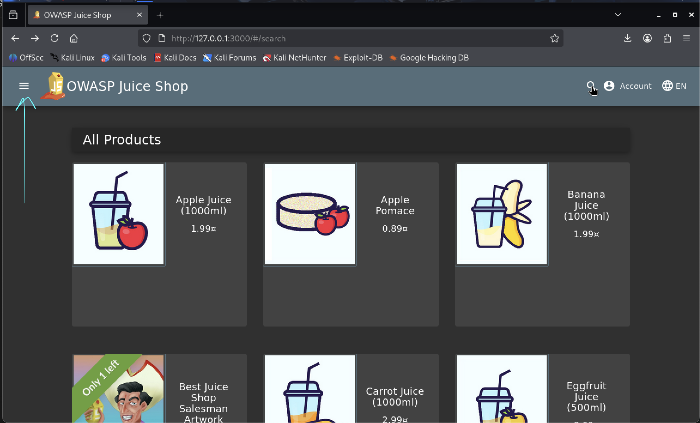
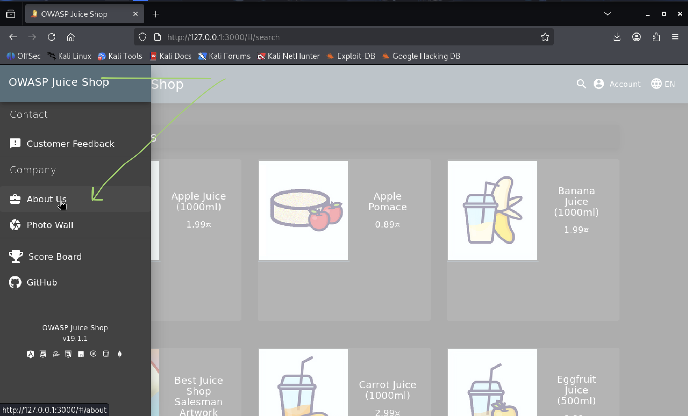
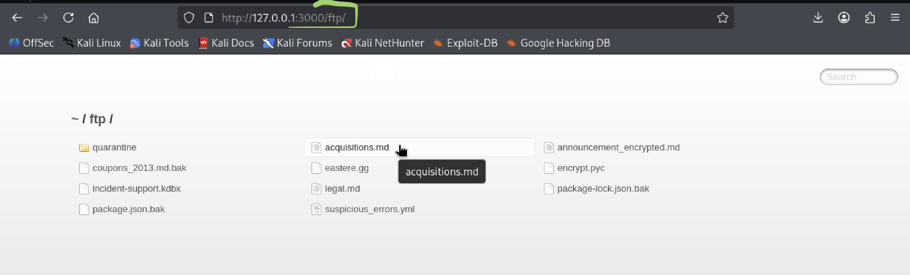

# Find Restricted Document

## Challenge Description

The objective of this challenge is to locate a restricted document within the OWASP Juice Shop application by analyzing publicly accessible links and manually manipulating URLs using a web browser.

## Disclaimer

This challenge was solved in a controlled lab environment and is documented strictly for educational purposes.

---

## Table of Contents

- [Usage](#usage)
- [Recording of the Challenge](#recording-of-the-challenge)
- [Vulnerability Category](#vulnerability-category)
- [Tools Used](#tools-used)
- [Step-by-Step Solution](#step-by-step-solution)
- [Result](#result)
- [Security Impact](#security-impact)
- [Mitigation](#mitigation)
- [Disclaimer](#disclaimer)

---

## Usage

This challenge is performed in a local or controlled lab environment using the OWASP Juice Shop application. The user interacts with the application through a web browser to analyze publicly accessible links and test access control by manually modifying URLs.

---

## Recording of the Challenge

https://go.screenpal.com/watch/cOVDXanrKV3

---

## Vulnerability Category

Broken Access Control / Directory Listing

---

## Tools Used

- Kali Linux
- Mozilla Firefox

---

## Step-by-Step Solution

1. Start the OWASP Juice Shop application locally.

   

2. Navigate to the **About Us** page via the sidebar menu

   

3. Identify a publicly accessible document link pointing to `/ftp/legal.md` and click on this link

   

4. Manually modify the URL in the browser’s address bar by removing the file name `legal.md`

   

5. Access the `/ftp/` directory and browse through the folders and files

   

7. Open the restricted document

   

---

## Result

The application allowed unrestricted access to internal files and directories without authentication or authorization checks.

---

## Security Impact

Due to missing access control, unauthorized users can browse internal directories and access sensitive files. This may lead to information disclosure, data leaks, and potential legal or compliance issues.

---

## Mitigation

- Disable directory listing on the web server.
- Implement proper access control and authorization checks.
- Restrict public access to internal directories such as `/ftp/`.
- Validate and sanitize all user-accessible file paths.

