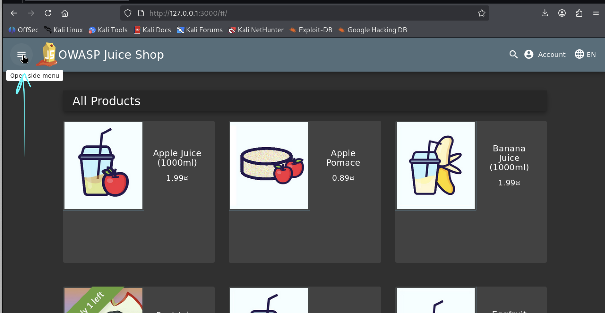
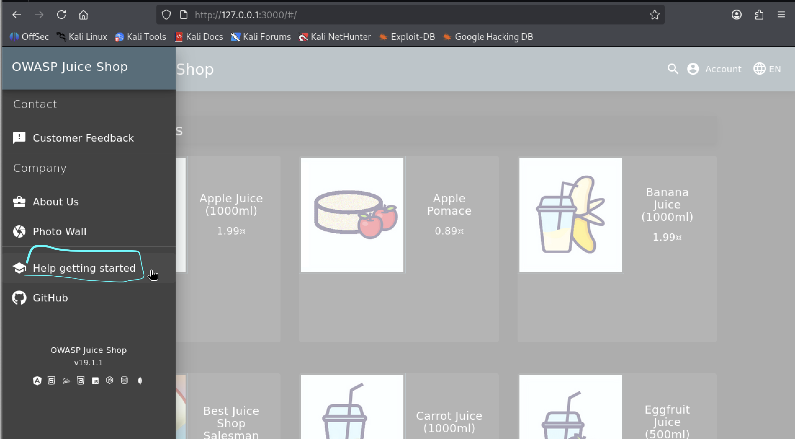
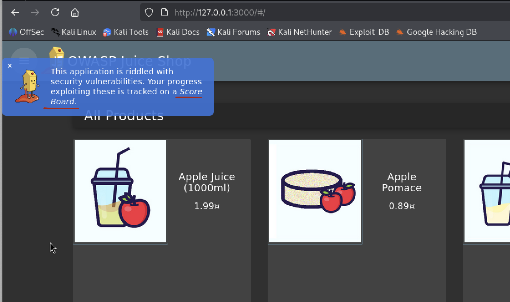
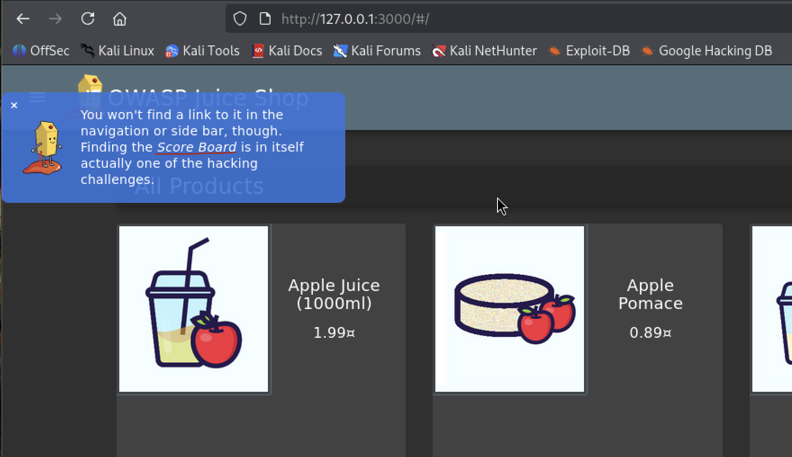
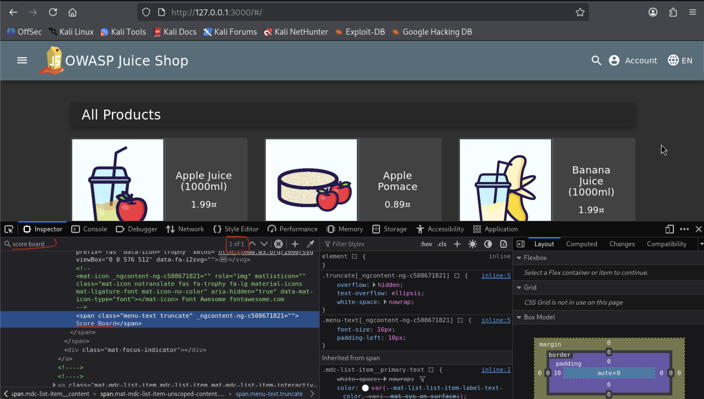
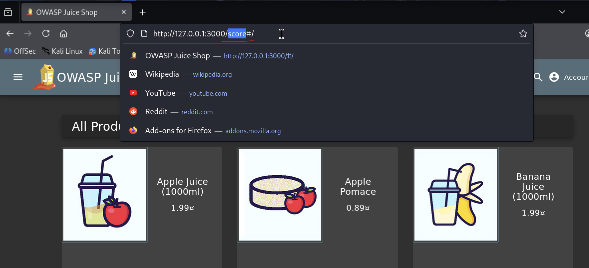
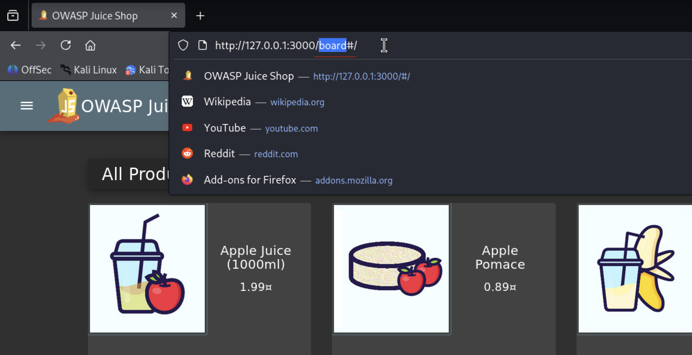
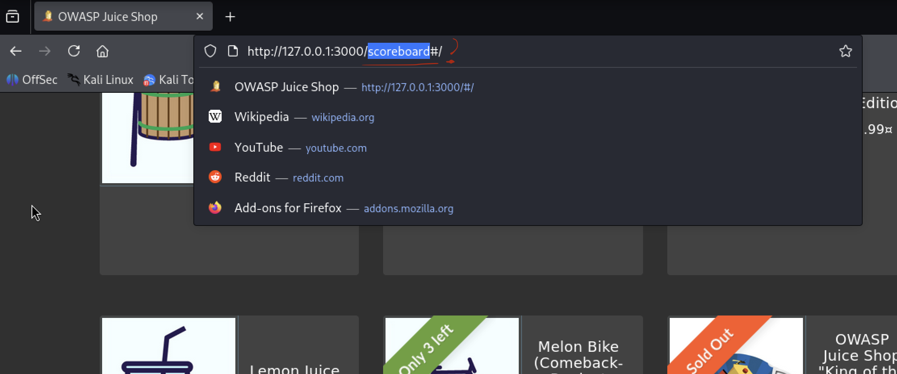
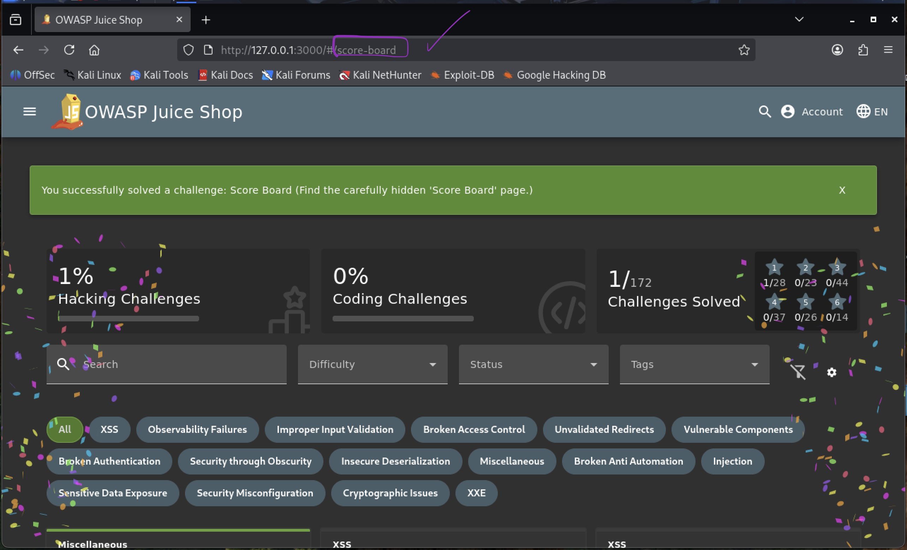

# Find the Score Board

## Challenge Description

The objective of this challenge is to discover the hidden Score Board page of the OWASP Juice Shop application by manually accessing a known but undocumented URL endpoint using a web browser.

---

## Disclaimer

This challenge was solved in a controlled lab environment and is documented strictly for educational purposes.
The OWASP Juice Shop application must be started locally before performing this challenge (see Quickstart section of the main repository).  

The interaction is performed entirely through a web browser

The application can be started using

```bash
npm start
```
---

## Table of Contents

- [Disclaimer](#disclaimer)
- [Challenge Name](#challenge-name)
- [Challenge Description](#challenge-description)
- [Usage](#usage)
- [Recording of the Challenge](#recording-of-the-challenge)
- [Vulnerability Category](#vulnerability-category)
- [Tools Used](#tools-used)
- [Step-by-Step Solution](#step-by-step-solution)
- [Result](#result)
- [Security Impact](#security-impact)
- [Mitigation](#mitigation)


---

## Challenge Name

Find the Score Board

---

## Usage

1. Start the OWASP Juice Shop application locally.
2. Open a web browser.
3. Navigate to `http://127.0.0.1:3000`.
4. Ensure the application is running and accessible.
5. Follow the steps described in the **Step-by-Step Solution** section to reproduce the challenge.

---

## Recording of the Challenge

https://go.screenpal.com/watch/cOV6rinrwxN

---

## Vulnerability Category

Information Disclosure

This challenge has a difficulty rating of 1 star (1/6).

---

## Tools Used

- Kali Linux  
- Mozilla Firefox  

---

## Step-by-Step Solution

1. Open the OWASP Juice Shop application in a web browser and ensure the main page is displayed

   

2. Open the sidebar menu and select **Help getting started** to review available hints and guidance provided by the application

   

3. Review the displayed hints and challenges

   Within the help section, references to a **Score Board** were identified, indicating the existence of an internal page that provides an overview of challenges and progress.

   
   

4. To verify whether the Score Board is referenced elsewhere in the application, the browser’s developer tools were opened and the HTML content was searched for the term **Score Board**

   The search returned only references from the help section, suggesting that the Score Board page is not directly linked within the application interface.

   

5. Based on common web application patterns, potential URL paths were tested manually by appending variations such as `/score`, `/board`, and `/scoreboard` to the base URL.

   These attempts did not return the expected page.

   
   
   

6. Further analysis of existing application routes revealed that multi-word menu items are often represented using hyphenated paths (e.g. **Photo Wall** → `/photo-wall`).

   Based on this observation, the URL `/score-board` was tested

   

7. The Score Board page was successfully accessed without authentication or authorization.  
   The page exposes a complete overview of challenges and their completion status, confirming that the endpoint is publicly accessible despite not being linked within the application

---

## Result

The Score Board page, which is not linked anywhere in the application interface, was accessible directly via its URL without authentication or authorization.

---

## Security Impact

Exposing the Score Board allows unauthorized users to gain insight into the internal structure and status of the application. In real-world scenarios, this type of information disclosure could reveal sensitive internal data, application logic, or security weaknesses that may facilitate further attacks.

---

## Mitigation

- Restrict access to administrative or internal pages such as the Score Board.
- Implement proper authentication and authorization checks.
- Protect sensitive endpoints with role-based access control.
- Avoid exposing internal status or debugging pages in production environments.

---
